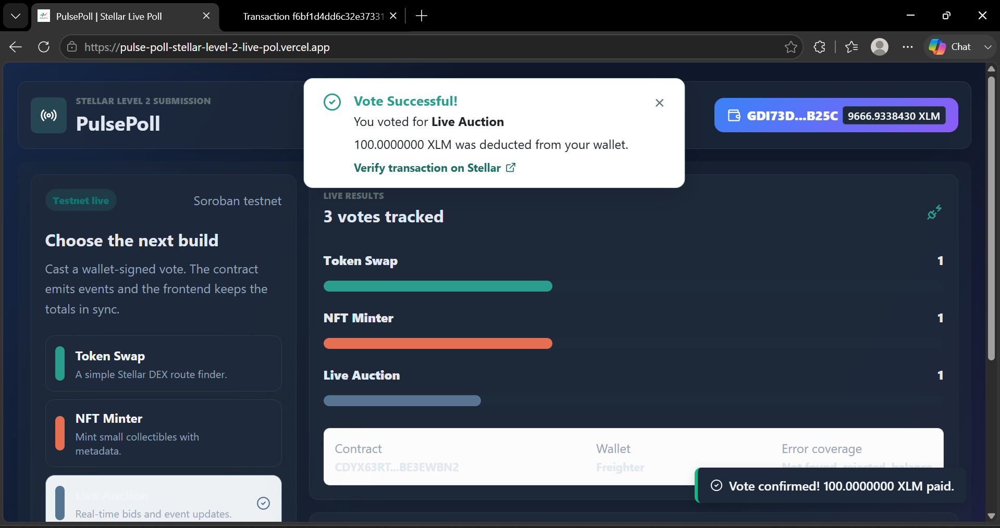

# PulsePoll ✦ Stellar Level 2 Live Poll

**PulsePoll** is a premium, real-time decentralized polling application built on the **Stellar Soroban Smart Contract Platform**. It provides a sleek, glassmorphic dark-theme interface that connects multiple browser extension wallets, tracks contract state through transaction simulation, and streams ledger event logs in real-time.

---

## 🚀 Verifiable Testnet Deployment

The smart contract is compiled, deployed, initialized, and seeded on the **Stellar Testnet**:

*   **Live Portal Link:** [https://pulse-poll-stellar-level-2-live-pol.vercel.app/](https://pulse-poll-stellar-level-2-live-pol.vercel.app/)
*   **Smart Contract Address:** `CDYX63RTQASCYL6R7MXDADPQEFILKYJDZBAGQQ4SKJAZ6Y5NBE3EWBN2`
    *   *Verify on Stellar.expert:* [Stellar Explorer Contract Link](https://stellar.expert/explorer/testnet/contract/CDYX63RTQASCYL6R7MXDADPQEFILKYJDZBAGQQ4SKJAZ6Y5NBE3EWBN2)
*   **Contract Deployment Transaction Hash:** `5fdbc0021ae05e0cebedaf787c14244749218fa527853524ab33062c49a1edc2`
    *   *Verify on Stellar.expert:* [Deployment Tx Details](https://stellar.expert/explorer/testnet/tx/5fdbc0021ae05e0cebedaf787c14244749218fa527853524ab33062c49a1edc2)
*   **Sample Contract Call (Vote) Transaction Hash:** `f6bf1d4dd6c32e37331c52676bd45ab70c1ee53db0a1f5b50d628e667f5b6c0e`
    *   *Verify on Stellar.expert:* [Vote Tx Details](https://stellar.expert/explorer/testnet/tx/f6bf1d4dd6c32e37331c52676bd45ab70c1ee53db0a1f5b50d628e667f5b6c0e)

### Live Poll Options (Default State)
Three default voting options have been established on-chain for the community to vote on:
1.  **Token Swap Interface**
2.  **NFT Minter**
3.  **Live Auction**

---

## 🛡️ Core Features & Level 2 Requirements Met

### 1. Live Polling & Dynamic Results
*   **On-Chain Results:** Users can view the current tally of all votes directly sourced from the Stellar ledger dynamically.
*   **Interactive Voting:** Connect your wallet and select an option to submit your vote on the Stellar testnet. It updates the global UI in real-time.

### 2. Premium UX Aesthetics
*   **Modern Design:** Features a unique, responsive dark mode layout with beautiful gradients and micro-interactions.
*   **Real-time Animations:** Loading spinners and transaction status cards that cleanly reflect the application's ongoing processes.

### 3. Multi-Wallet Integration
Uses `@creit.tech/stellar-wallets-kit` to support multiple browser wallets under a single static connector interface:
*   **Freighter** (Stellar Development Foundation)
*   **Albedo**
*   **xBull**
*   **Hana Wallet**

### 4. Smart Contract Called from Frontend
*   **Read State:** The application polls all current votes from the contract's `results` method via gas-free RPC simulation.
*   **Write State:** Bidders submit their choice via the contract's `vote` method, which is simulated, signed by the browser wallet, and submitted.

### 5. Real-Time Event Listening & State Synchronization
*   The contract publishes a `vote` event with the selected option.
*   The frontend automatically refreshes the UI state upon a successful vote from live testnet state.

### 6. Transaction Status & Explorer Link Visibility
An interactive **Transaction Lifecycle Tracker** shows the state machine progression in real-time:
`Connecting Wallet` ➔ `Awaiting Signature` ➔ `Submitting to Testnet` ➔ `Success / Error`.
Clickable hyperlinks to the transaction on `Stellar.expert` are generated.

### 7. Core Error Types Handled
1.  **Wallet Extension Missing / Not Found:** Prompts the user with details if the wallet extension cannot be detected.
2.  **User Rejected Connection / Signature:** Intercepts wallet cancellation and gracefully handles rejection without breaking the UI.
3.  **Insufficient Balance / Network Errors:** Catches network timeouts or lack of testnet XLM and provides clear diagnostic messages.

---

## 📸 Application Visual Walkthrough

Here is a visual walkthrough of the **PulsePoll** live poll application showcasing the completed features and Level 2 requirements:

### 1. Wallet Integration Options
Connecting your wallet uses `StellarWalletsKit` supporting multiple wallet providers natively:


### 2. Successful Vote Verification
The UI features real-time feedback and displays success alerts after placing a verified on-chain vote:


---

## 🛠️ Local Development & Quick Start

Follow these steps to run the application locally:

### Prerequisites
*   Node.js (v18+ or v20+)
*   npm (v9+)
*   Rust / Cargo (Only if compiling the smart contract yourself)

### Installation
1.  Install dependencies:
    ```bash
    npm install
    ```

2.  Copy the environment variables:
    ```bash
    cp .env.example .env.local
    ```

3.  Run the local development server:
    ```bash
    npm run dev
    ```

4.  Open [http://localhost:5173](http://localhost:5173) in your browser.

---

## 📦 Compilation & Redeployment (Optional)

If you modify the smart contract and wish to compile/redeploy it:

1.  **Compile Rust Contract to WebAssembly:**
    Navigate to the root directory and build:
    ```bash
    npm run contract:build
    ```

2.  **Run the Deployment Script:**
    Make sure you have `DEPLOYER_SECRET_KEY` set in `.env.local`, then deploy:
    ```bash
    npm run contract:deploy
    ```
